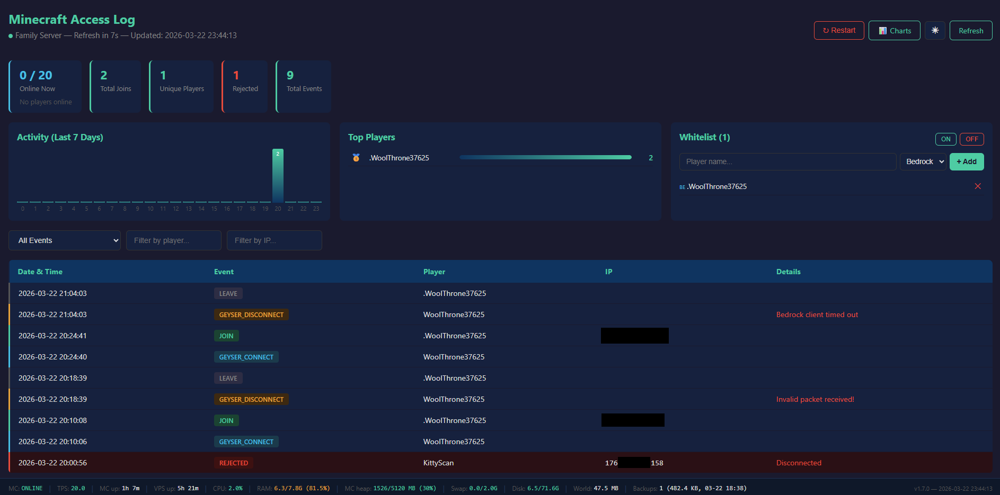
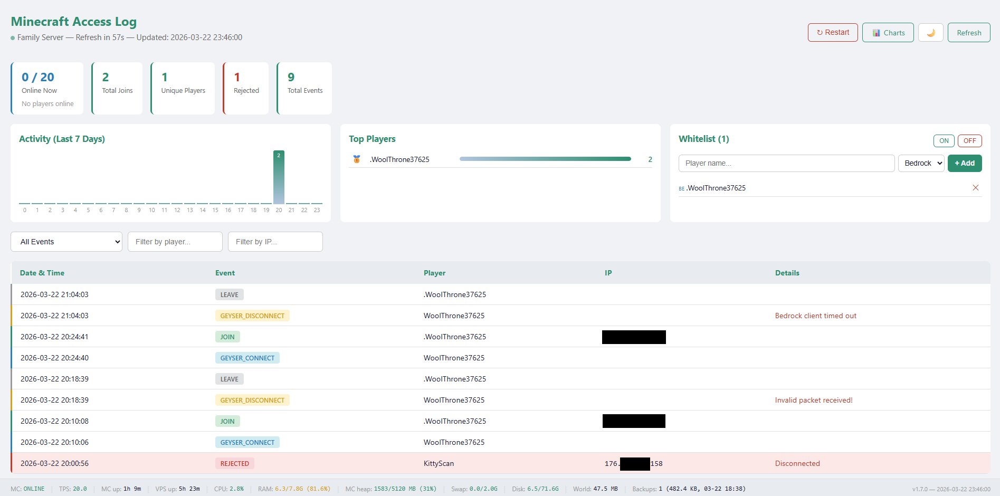
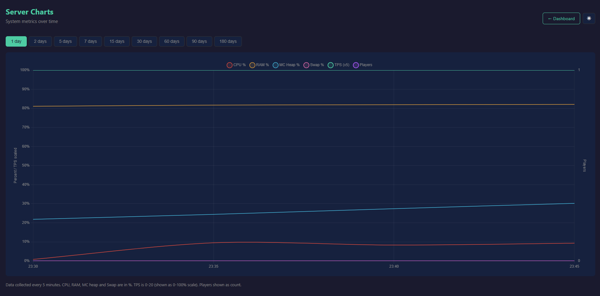
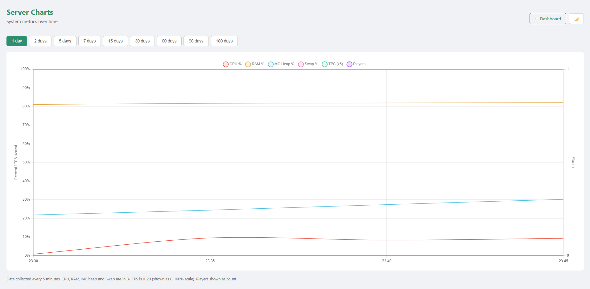

# Minecraft Server Dashboard

A lightweight web-based monitoring and management dashboard for Minecraft servers running in Docker. Built with Python/Flask, no database required — all data stored in JSON files.

## Features

- **Real-time server status** — Online players (with names), TPS, server uptime, MC heap usage
- **Access logs** — Track player joins, leaves, and rejected connection attempts with timestamps and IPs
- **Whitelist management** — Add/remove Java and Bedrock players, toggle whitelist on/off from the browser
- **Server restart** — One-click restart with confirmation dialog
- **Historical metrics** — CPU, RAM, MC heap, swap, TPS, player count collected every 5 minutes
- **Interactive charts** — Chart.js graphs with selectable time ranges (1 day to 6 months)
- **Top players** — Leaderboard of most frequent players
- **Activity chart** — Hourly join distribution over the last 7 days
- **Suspicious IP alerts** — Automatic warning when an IP has 5+ rejected connection attempts
- **System status bar** — CPU, RAM, MC heap, swap, disk, world size, backup info
- **Dark/Light theme** — Toggle with cookie persistence
- **Mobile responsive** — Optimized for phone screens
- **Auto-refresh** — 60-second refresh with countdown timer
- **HTTP Basic Auth** — Password-protected access

## Screenshots

### Dashboard — Dark Theme


### Dashboard — Light Theme


### Charts — Dark Theme


### Charts — Light Theme


## Requirements

- Minecraft server running via [itzg/docker-minecraft-server](https://github.com/itzg/docker-minecraft-server) Docker image
- Python 3.10+
- Flask
- psutil

## Installation

### 1. Install dependencies

```bash
pip install flask psutil --break-system-packages
```

### 2. Download the files

```bash
git clone https://github.com/YOUR_USERNAME/minecraft-server-dashboard.git
cd minecraft-server-dashboard
```

### 3. Configure credentials

Edit `mc-access-web.py` and change the username and password:

```python
USERNAME = "your_username"
PASSWORD = "your_password"
```

### 4. Configure paths

If your Minecraft server data is not in `/opt/minecraft/data`, edit these constants in `mc-access-web.py`:

```python
BACKUP_DIR = "/opt/minecraft/backups"    # Path to your backup directory
WORLD_DIR = "/opt/minecraft/data"        # Path to your Minecraft server data
```

And in `mc-access-logger.py`:

```python
LOG_FILE = "/home/pi/mc-access-log.json"
METRICS_FILE = "/home/pi/mc-metrics.json"
STATE_FILE = "/home/pi/.mc-logger-state"
```

### 5. Install as a systemd service

```bash
sudo cp mc-access-web.service /etc/systemd/system/
```

Edit the service file to match your username and paths:

```bash
sudo nano /etc/systemd/system/mc-access-web.service
```

```ini
[Unit]
Description=Minecraft Server Dashboard
After=network.target

[Service]
Type=simple
User=your_username
ExecStart=/usr/bin/python3 /home/your_username/mc-access-web.py
Restart=on-failure
RestartSec=5

[Install]
WantedBy=multi-user.target
```

Start the service:

```bash
sudo systemctl daemon-reload
sudo systemctl enable mc-access-web
sudo systemctl start mc-access-web
```

### 6. Open the firewall port

```bash
sudo ufw allow 8090/tcp comment 'MC Dashboard'
```

### 7. Setup the metrics collector

```bash
crontab -e
```

Add:

```
*/5 * * * * /usr/bin/python3 /home/your_username/mc-access-logger.py
```

### 8. Access the dashboard

Open `http://YOUR_SERVER_IP:8090` in your browser.

## How It Works

### mc-access-logger.py

Runs every 5 minutes via cron. Performs two tasks:

**1. Access log parsing** — Reads Docker container logs (`docker logs minecraft --timestamps`), extracts player events (join, leave, rejected connections, Geyser connect/disconnect), and appends them to a JSON file. Tracks its position in the log to avoid re-processing old entries. Strips ANSI color codes from log output.

**2. Metrics collection** — Queries the system (via psutil) and the Minecraft server (via RCON) to collect:

| Metric | Source | Description |
|--------|--------|-------------|
| CPU % | psutil | System CPU usage |
| RAM % | psutil | System RAM usage |
| Swap % | psutil | Swap usage |
| MC Heap % | `memory` RCON command | Java heap usage |
| TPS | `tps` RCON command | Server ticks per second |
| Players | `list` RCON command | Online player count |

Metrics are stored in a compact JSON file with automatic retention (default: 6 months).

### mc-access-web.py

A Flask web application with two pages:

**Main dashboard (`/`)** displays:
- Stat boxes: online players (with names), total joins, unique players, rejected attempts
- Three panels: hourly activity chart, top players leaderboard, whitelist management
- Filterable and paginated access log table (by event type, player name, IP)
- System status bar with live server metrics
- Suspicious IP alerts

**Charts page (`/charts`)** displays:
- Interactive Chart.js graph with six overlaid metrics
- Separate Y axis for player count
- Time range selector: 1d, 2d, 5d, 7d, 15d, 30d, 60d, 90d, 180d
- Automatic downsampling for performance (max 500 data points)

### API Endpoints

| Endpoint | Method | Description |
|----------|--------|-------------|
| `/` | GET | Main dashboard |
| `/charts` | GET | Charts page |
| `/api/metrics?days=N` | GET | JSON metrics data for last N days |
| `/api/whitelist/add` | POST | Add player (`name`, `type=bedrock\|java`) |
| `/api/whitelist/remove` | POST | Remove player (`name`) |
| `/api/whitelist/toggle` | POST | Toggle whitelist (`state=on\|off`) |
| `/api/restart` | POST | Restart Minecraft Docker container |

All endpoints require HTTP Basic Auth.

## File Structure

```
minecraft-server-dashboard/
├── README.md
├── LICENSE
├── .gitignore
├── mc-access-web.py             # Web dashboard application
├── mc-access-web.service        # Systemd service file
└── mc-access-logger.py          # Log parser + metrics collector
```

Runtime files (created automatically, excluded from git):

| File | Description |
|------|-------------|
| `~/mc-access-log.json` | Player access events |
| `~/mc-metrics.json` | Historical system metrics |
| `~/.mc-logger-state` | Logger position tracker |

## Configuration Reference

### mc-access-web.py

| Constant | Default | Description |
|----------|---------|-------------|
| `USERNAME` | `admin` | Dashboard login username |
| `PASSWORD` | `changeme` | Dashboard login password |
| `LOG_FILE` | `/home/pi/mc-access-log.json` | Path to access log file |
| `METRICS_FILE` | `/home/pi/mc-metrics.json` | Path to metrics file |
| `BACKUP_DIR` | `/opt/minecraft/backups` | Path to backup directory |
| `WORLD_DIR` | `/opt/minecraft/data` | Path to Minecraft server data |
| `PER_PAGE` | `50` | Events per page in the log table |
| `SUSPICIOUS_THRESHOLD` | `5` | Rejected attempts before IP alert |

### mc-access-logger.py

| Constant | Default | Description |
|----------|---------|-------------|
| `LOG_FILE` | `/home/pi/mc-access-log.json` | Path to access log output |
| `METRICS_FILE` | `/home/pi/mc-metrics.json` | Path to metrics output |
| `STATE_FILE` | `/home/pi/.mc-logger-state` | Logger position state |
| `METRICS_RETENTION_DAYS` | `180` | How many days of metrics to keep |

## Compatibility

Tested with:
- [itzg/docker-minecraft-server](https://github.com/itzg/docker-minecraft-server) Docker image
- Paper 1.21.4
- GeyserMC + Floodgate (detects Bedrock players by dot prefix in whitelist.json)
- Ubuntu 22.04 / 24.04
- Python 3.10, 3.11, 3.12

Should work with any Minecraft server running in a Docker container named `minecraft` with RCON enabled.

## Known Limitations

- **Bedrock whitelist** — Bedrock players must connect once before they can be whitelisted via `fwhitelist add`. Workaround: temporarily toggle whitelist off from the dashboard.
- **Chart.js CDN** — Charts page loads Chart.js from `cdn.jsdelivr.net`. For air-gapped environments, download and serve locally.
- **Single server** — Monitors one Docker container named `minecraft`. Multi-server support would require configuration changes.
- **No HTTPS** — Runs on plain HTTP. For production, use an Nginx reverse proxy with SSL.
- **Docker socket access** — The user running the dashboard needs permission to execute `docker exec` commands.

## Contributing

Contributions are welcome! Please open an issue or submit a pull request.

## License

This project is licensed under the MIT License — see the [LICENSE](LICENSE) file for details.
