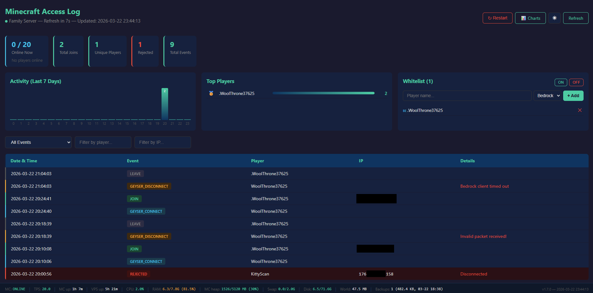
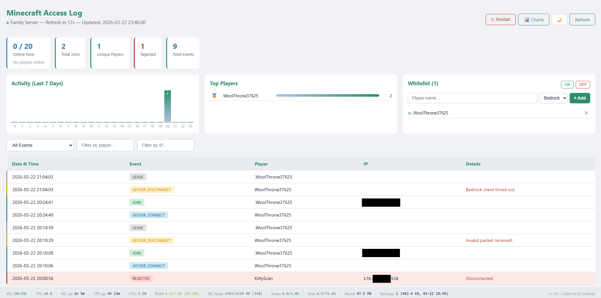
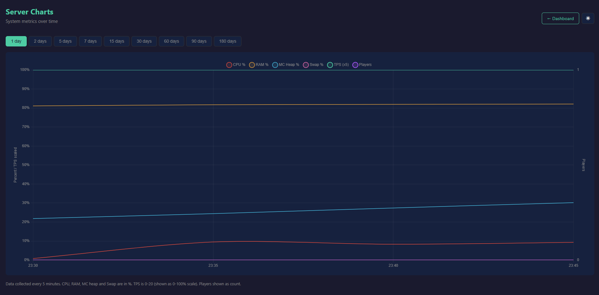
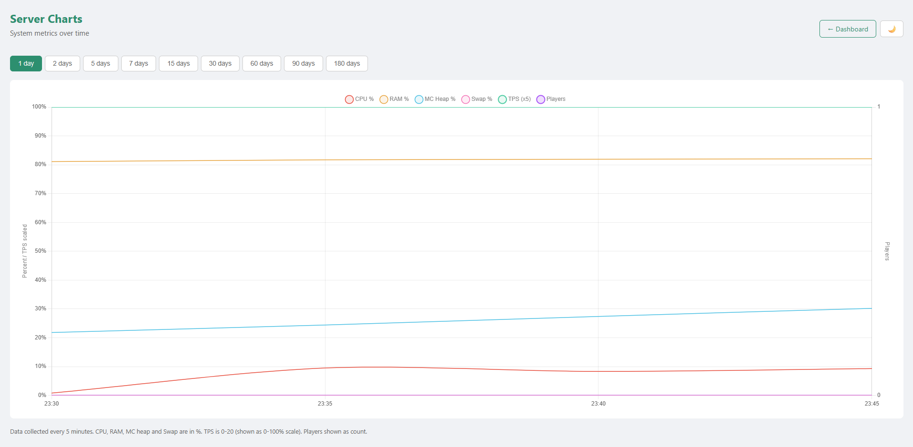

# Minecraft Server Dashboard

A web-based monitoring and management dashboard for Minecraft servers running in Docker. Built with Python/Flask, no database required — all data stored in JSON files. Designed for small private servers (a class of kids, a family, a friend group) where the operator wants to manage day-to-day operations without SSHing in.

Tested on a Paper 1.21.4 server with GeyserMC for Bedrock cross-play, hosting ~10–15 second-grade kids on a Contabo VPS.

## Features

**Server monitoring** (live, refreshed every 5 seconds without full page reload)

- Online players with skin head icons, TPS, server uptime, MC heap usage
- CPU, RAM, swap, disk, world size, last backup info
- Suspicious-IP alerts when an IP gets 10+ rejected connection attempts (configurable)
- Historical metrics (CPU, RAM, MC heap, swap, TPS, online count) collected every 5 minutes, retained 180 days

**Player management** on a dedicated `/players` page

- Whitelisted vs other-connections sections, sorted by total playtime
- Per-player stats: joins, leaves, total play time, sessions, average and longest session, first/last seen, IPs
- **Teleport modal** — to another player or X/Y/Z coordinates, with `~` relative support and saved location bookmarks
- **Nick modal** — set or clear EssentialsX nicknames (`/nick name [value|off]`)
- **Quick actions modal** — kick (with reason), ban/pardon, gamemode (survival/creative/adventure/spectator), OP/de-op
- **Auto-Bedrock onboarding** — temporarily disables whitelist, watches docker logs, auto-adds Bedrock player when they connect, then re-enables whitelist. A server-side watchdog re-enables the whitelist when the window expires even if no browser is open
- Auto-detection of Java vs Bedrock via Mojang API (cached 1 hour)

**Plugin management** on `/plugins`

- Live grid of installed plugins with version, file, size, status badge
- Search by name, sort (name/size/status), filter (all / no URL / has URL / JAR missing)
- Per-plugin update via saved URL — downloads to staging, SHA-256 compares, **discards if identical** (no unnecessary restart)
- Update All — sequential per-plugin downloads with individual toasts and final summary
- **Recent updates** list with old/new size and signed delta (e.g. `+304 KB`)
- "Updated 2h ago" badge on cards updated in the last 24 hours
- Restart-needed banner with one-click server restart after a real change

**Backups** on `/backups`

- Aggregate stats (count, total size, average, world size, newest, oldest)
- Status banner colored by age (ok / `>30h` warn / `>48h` bad / no backups)
- Full archive table with size, **delta vs previous backup**, creation date, age
- **Backup now** button — pauses world saving (`save-off` + `save-all flush`), tars the world dirs in a background thread with live progress, then `save-on`
- **Delete** button per archive (filename validated, confined to the backup dir)

**Bans** on `/bans`

- **Auto-ban**: the watchdog thread bans IPs that reach `AUTO_BAN_THRESHOLD` (default 20) rejected connection attempts. IPs with any successful JOIN and private ranges are never auto-banned
- Ban method: `sudo -n ufw insert 1 deny from <ip>` (firewall-level, needs a sudoers entry — see installation) with automatic fallback to RCON `ban-ip` (game-level only)
- Ban list with **country** (ip-api.com lookup at ban time, flag emoji), reason, source (auto/manual), date and method
- Manual ban / unban from the page; unban uses the same method the ban was made with

**RCON console** on `/console`

- Free-form server command with output, arrow-key history, confirmation prompt for destructive commands (`stop`, `ban`, `op`, `whitelist off`...)
- Every command is logged with the client IP. Adds no new attack surface — dashboard credentials already carry RCON-equivalent power via the other endpoints

**Chat** on `/chat`

- Persistent in-game chat history backed by `mc-chat-log.json` (written by the logger), retention 90 days, cap 50 000 messages
- Range selector: 1 hour to 90 days (default 24 hours)
- Search box with match highlighting, sender filter (any / players / server)
- Day separators between messages
- Send `[Server]` messages directly from the browser via `/say` RCON
- Optional 5-second auto-refresh

**Logs viewer** on `/logs`

- Tail of `docker logs minecraft` — configurable size 100 to 2000 lines
- Level filter (All / INFO+ / WARN+ / ERROR only)
- Substring search with highlighted matches
- Optional live mode (5-second auto-refresh) with pulsing indicator
- Color-coded rows (red ERROR, yellow WARN)

**Charts** on `/charts`

- Six overlaid system metrics with selectable time ranges (1d to 180d)
- **Storage trend chart** — disk %, world size GB, total backup size GB over time
- **Per-player playtime bar chart** with player selector and 14/30/60/90-day range
- Automatic downsampling to 500 data points

**General**

- Whitelist ON/OFF live indicator on the dashboard (reads `server.properties`)
- Dark/light theme toggle with cookie persistence
- Mobile-responsive
- HTTP Basic Auth
- CSRF protection on every POST endpoint
- All user input HTML-escaped, all RCON arguments regex-validated to prevent injection
- Atomic JSON writes to prevent corruption
- Toast notifications for actions (replaces full-page redirects)

## Screenshots

### Dashboard




### Charts




### Plugins, Players, Backups, Chat, Logs

*(Add fresh screenshots — old ones don't reflect current pages.)*

## Requirements

- Minecraft server running via [itzg/docker-minecraft-server](https://github.com/itzg/docker-minecraft-server) Docker image, with RCON enabled
- Python 3.10+
- Flask, psutil, markupsafe (Flask installs the latter as a dependency)

## Installation

### 1. Install dependencies

```bash
pip install flask psutil --break-system-packages
```

### 2. Clone the repo

```bash
git clone https://github.com/linuxxp/minecraft-server-dashboard.git
cd minecraft-server-dashboard
```

### 3. Configure credentials

Credentials are **not** stored in the code. On first start the app creates an auth file (default `/home/pi/mc-web-auth.json`, mode 0600) with username `admin` and a random password:

```json
{
  "username": "admin",
  "password": "generated-random-password"
}
```

Open the file to see the generated password, edit it to set your own credentials, then restart the service. Alternatively, set the `MC_WEB_USERNAME` and `MC_WEB_PASSWORD` environment variables (e.g. in the systemd unit) — they take precedence over the file. The auth file location itself can be changed with `MC_WEB_AUTH_FILE`.

These are checked via HTTP Basic Auth. The dashboard does not have a login page — your browser shows the standard credentials prompt.

### 4. Configure paths

If your Minecraft server data is not in `/opt/minecraft/data`, edit these constants in `mc-access-web.py`:

```python
WORLD_DIR = "/opt/minecraft/data"      # plugins/, whitelist.json, world/
BACKUP_DIR = "/opt/minecraft/backups"  # world-*.tar.gz archives
```

In `mc-access-logger.py`, the only files you may need to change are the JSON output paths (defaulting to `/home/pi/`).

### 5. Install as a systemd service

```bash
sudo cp mc-access-web.service /etc/systemd/system/
sudo nano /etc/systemd/system/mc-access-web.service   # adjust User and ExecStart paths
sudo systemctl daemon-reload
sudo systemctl enable --now mc-access-web
```

### 6. Open the firewall port

```bash
sudo ufw allow 8090/tcp comment 'MC Dashboard'
```

For public exposure, prefer fronting with Nginx + Let's Encrypt rather than exposing port 8090 directly.

### 6a. (Optional) Allow firewall-level bans

The `/bans` page and the auto-ban feature prefer blocking IPs with `ufw`, which requires the dashboard's user to run `ufw` via sudo without a password. Add a sudoers entry:

```bash
echo 'your_username ALL=(root) NOPASSWD: /usr/sbin/ufw' | sudo tee /etc/sudoers.d/mc-dashboard-ufw
sudo chmod 440 /etc/sudoers.d/mc-dashboard-ufw
```

Without this, bans still work but fall back to RCON `ban-ip`, which only blocks the game — port scanners will still hit the port.

### 7. Set up the metrics + chat + logs collector

```bash
crontab -e
```

Add:

```
*/5 * * * * /usr/bin/python3 /home/your_username/mc-access-logger.py
```

This single cron task does three things every 5 minutes: parses access events from docker logs, captures chat messages to `mc-chat-log.json`, and snapshots system + RCON metrics to `mc-metrics.json`. Without it the dashboard still works but historical metrics, chat history and access events stop updating.

### 8. Open the dashboard

`http://YOUR_SERVER_IP:8090` — your browser will prompt for the credentials configured in step 3.

## How It Works

### `mc-access-logger.py`

Runs every 5 minutes via cron. Three responsibilities:

1. **Access events.** Reads `docker logs minecraft --timestamps`, identifies JOIN / LEAVE / kicked / Geyser-connect / Geyser-disconnect lines, and appends them to `mc-access-log.json`. Tracks position to avoid re-processing old log lines, strips ANSI color codes.
2. **Chat messages.** Captures `<Player> message` and `[Server] message` lines into `mc-chat-log.json`, deduplicating against the last 200 entries (the 5-minute scan window naturally overlaps the previous one). Retention 90 days, cap 50 000 messages.
3. **Metrics.** Queries the system (psutil) and the Minecraft server (RCON `memory`, `tps`, `list`) and snapshots CPU%, RAM%, swap%, MC heap%, TPS and online-player count to `mc-metrics.json` (180-day retention).

### `mc-access-web.py`

Flask web application. Seven pages:

| Path | Page |
|------|------|
| `/` | Dashboard — stats, online list, whitelist management, recent events |
| `/charts` | Six-line metrics chart + per-player playtime chart |
| `/players` | Player cards with playtime, teleport/nick actions |
| `/plugins` | Plugin grid with search/sort/filter, update controls, history |
| `/backups` | Backup file list with deltas, status, world size |
| `/chat` | Persistent chat history with search/filter, send form |
| `/logs` | Docker logs tail with level filter, search, live mode |
| `/bans` | Banned IPs with country/date/method, manual ban/unban |
| `/console` | RCON console with history and confirmations |

Live data is fetched via JSON endpoints behind a 5-second poller, so navigating between pages or watching one open doesn't trigger full HTML re-renders.

## API endpoints

All endpoints require HTTP Basic Auth. `POST` endpoints additionally require a CSRF token (`csrf_token` form field, served from the page that triggers the action).

### Pages

| Method | Path | Description |
|--------|------|-------------|
| GET | `/` | Dashboard |
| GET | `/charts` | Charts page |
| GET | `/players` | Players page |
| GET | `/plugins` | Plugins page |
| GET | `/backups` | Backups page |
| GET | `/chat` | Chat page |
| GET | `/logs` | Logs page |
| GET | `/bans` | Bans page |
| GET | `/console` | Console page |

### Read APIs

| Method | Path | Description |
|--------|------|-------------|
| GET | `/api/status` | Live server stats (~28 fields) |
| GET | `/api/metrics?days=N` | Historical metrics, downsampled |
| GET | `/api/players` | Roster with playtime totals |
| GET | `/api/playtime/<name>?days=N` | Daily playtime for a player |
| GET | `/api/detect-platform?name=X` | Java/Bedrock guess via Mojang API |
| GET | `/api/chat?minutes=N&search=X` | Chat messages (max 90 days, 5000 msgs) |
| GET | `/api/logs?tail=N&level=X&search=Y` | Docker log lines (max 2000) |
| GET | `/api/locations` | Saved teleport bookmarks |
| GET | `/api/plugins/history` | Last 50 plugin update events |
| GET | `/api/bans` | Banned IPs (newest first) |
| GET | `/api/backups/status` | Running/last backup job state |

### Write APIs (require CSRF)

| Method | Path | Description |
|--------|------|-------------|
| POST | `/api/whitelist/add` | `name`, `type=auto\|java\|bedrock` |
| POST | `/api/whitelist/remove` | `name` |
| POST | `/api/whitelist/toggle` | `state=on\|off` |
| POST | `/api/whitelist/onboard` | Start Bedrock onboarding (`name`, `duration_minutes`) |
| POST | `/api/whitelist/onboard/cancel` | Cancel onboarding, re-enable whitelist |
| POST | `/api/restart` | `docker compose restart` |
| POST | `/api/teleport` | `name`, plus either `target` (player) or `coords` (`X Y Z`, `~` allowed) |
| POST | `/api/nick` | `name`, `nick` (or `reset=1`) |
| POST | `/api/chat/send` | `text` (broadcasts via `/say`) |
| POST | `/api/locations/add` | `name`, `coords` |
| POST | `/api/locations/remove` | `name` |
| POST | `/api/plugins/update` | `file`, `url` (downloads, SHA-256 dedupes) |
| POST | `/api/plugins/update-all` | Iterates all saved URLs |
| POST | `/api/backups/create` | Start a backup job (background thread) |
| POST | `/api/backups/delete` | `filename` (must match `world-*.tar.gz`) |
| POST | `/api/bans/add` | `ip`, optional `reason` |
| POST | `/api/bans/remove` | `ip` (unban via the original method) |
| POST | `/api/player/action` | `name`, `action=kick\|ban\|pardon\|gamemode\|op\|deop`, optional `arg` |
| POST | `/api/console` | `cmd` (free-form RCON command, logged) |

When called with `X-Requested-With: fetch` (or `Accept: application/json`), POST endpoints respond with JSON `{ok, message, toast}` instead of redirecting. The browser UI uses fetch throughout.

## File structure

```
minecraft-server-dashboard/
├── README.md
├── LICENSE
├── .gitignore
├── mc-access-web.py             # Web dashboard (Flask)
├── mc-access-web.service        # Systemd unit
├── mc-access-logger.py          # Cron-driven log + metrics + chat collector
└── mc-plugin-urls.json          # Optional sample plugin URL map
```

Runtime files (created automatically, excluded from git):

| File | Description |
|------|-------------|
| `~/mc-access-log.json` | Player access events (capped at 10 000) |
| `~/mc-metrics.json` | Historical system metrics (180 days) |
| `~/mc-chat-log.json` | In-game chat history (90 days, 50k cap) |
| `~/mc-onboarding-state.json` | Active Bedrock onboarding session |
| `~/mc-locations.json` | Saved teleport bookmarks |
| `~/mc-plugin-urls.json` | Plugin filename -> download URL map |
| `~/mc-plugin-history.json` | Last 50 plugin update events |
| `~/mc-web-auth.json` | Dashboard credentials (auto-created, mode 0600) |
| `~/mc-banned-ips.json` | Banned IPs with country/date/method |
| `~/.mc-web-secret` | Flask session secret (32 random bytes, mode 0600) |
| `~/.mc-logger-state` | Logger position tracker |
| `~/mc-access-web.log` | App log |
| `~/mc-access-logger.log` | Logger log |

## Configuration reference

### `mc-access-web.py`

| Constant | Default | Description |
|----------|---------|-------------|
| `AUTH_FILE` | `/home/pi/mc-web-auth.json` | Credentials file (auto-created on first start); override path with `MC_WEB_AUTH_FILE`, or bypass entirely with `MC_WEB_USERNAME`/`MC_WEB_PASSWORD` env vars |
| `WORLD_DIR` | `/opt/minecraft/data` | Server data dir (`plugins/`, `whitelist.json`) |
| `BACKUP_DIR` | `/opt/minecraft/backups` | Where `world-*.tar.gz` archives live |
| `LOG_FILE` | `/home/pi/mc-access-log.json` | Access log read by web app |
| `METRICS_FILE` | `/home/pi/mc-metrics.json` | Metrics read by charts |
| `CHAT_FILE` | `/home/pi/mc-chat-log.json` | Chat log read by `/chat` |
| `PLUGIN_URLS_FILE` | `/home/pi/mc-plugin-urls.json` | Plugin URL map |
| `PLUGIN_HISTORY_FILE` | `/home/pi/mc-plugin-history.json` | Update history |
| `LOCATIONS_FILE` | `/home/pi/mc-locations.json` | Teleport bookmarks |
| `ONBOARDING_FILE` | `/home/pi/mc-onboarding-state.json` | Onboarding state |
| `SECRET_KEY_FILE` | `/home/pi/.mc-web-secret` | Flask session secret |
| `PER_PAGE` | `50` | Events per page in dashboard log table |
| `SUSPICIOUS_THRESHOLD` | `10` | Rejected attempts before IP alert |
| `AUTO_BAN_ENABLED` | `True` | Watchdog auto-bans aggressive IPs |
| `AUTO_BAN_THRESHOLD` | `20` | Rejected attempts before auto-ban |
| `ONBOARDING_DEFAULT_MINUTES` | `5` | Default Bedrock onboarding window |

### `mc-access-logger.py`

| Constant | Default | Description |
|----------|---------|-------------|
| `LOG_FILE`, `METRICS_FILE`, `CHAT_FILE` | as above | Output paths |
| `STATE_FILE` | `/home/pi/.mc-logger-state` | Logger cursor in docker logs |
| `METRICS_RETENTION_DAYS` | `180` | Drop metrics older than this |
| `CHAT_RETENTION_DAYS` | `90` | Drop chat older than this |
| `CHAT_MAX_MESSAGES` | `50000` | Hard cap on chat file size |

## Security

This is a low-stakes admin dashboard for a private server, but it does have RCON-equivalent power so we take a few common-sense precautions:

- **HTTP Basic Auth** on every endpoint, including JSON APIs. Credentials live in a separate auth file (mode 0600) or environment variables — never in the source. Comparison is constant-time (`hmac.compare_digest`).
- **CSRF token** required for every POST. Token is per-session, served via meta tag and form field.
- **Stable Flask session secret** stored in `~/.mc-web-secret` (32 random bytes, mode 0600), persisting across restarts so cookies don't get invalidated.
- **HTML-escape** on all rendered user content (player names, nicknames, chat text, plugin filenames, etc.) via `markupsafe.escape`.
- **Strict regex validation** on inputs that flow into RCON commands:
  - Player names: `^[A-Za-z0-9_]{1,32}$` (whitelist/onboarding accept Bedrock gamertags: spaces and dashes allowed)
  - Whitelist toggle state: only `on` / `off`
  - Coordinates: each token `^~?-?\d+(?:\.\d+)?$|^~$`
  - Nicknames: `^[A-Za-z0-9_\- ]{1,24}$`
  - Chat text: no control characters, max 200 chars
  - Plugin filenames: no `/`, `\`, leading dot
  - Plugin URLs: must start `http://` or `https://`
- **Atomic JSON writes** (`tempfile + os.replace`) so a process crash mid-write doesn't corrupt the metrics or events file.

What this project does not protect against:

- A compromised credential — anyone with valid Basic Auth credentials can run server-side commands. Use a strong password and don't expose port 8090 directly to the internet without TLS in front.
- Plain HTTP on the wire — credentials are sent base64 every request, so use a reverse proxy with HTTPS for anything beyond a LAN.

## Compatibility

Tested with:

- [itzg/docker-minecraft-server](https://github.com/itzg/docker-minecraft-server) Docker image (container named `minecraft`)
- Paper 1.21.4
- GeyserMC + Floodgate (Bedrock players carry a `.` prefix in `whitelist.json`; the code handles both forms)
- EssentialsX (used for `/nick` and as a richer player-name source)
- Ubuntu 24.04
- Python 3.10, 3.11, 3.12

Should work with any Minecraft server in a Docker container named `minecraft` with RCON enabled. Other names require renaming the `'minecraft'` literal in `mc-access-web.py` and `mc-access-logger.py`.

## Known limitations

- **Single server** — monitors one Docker container named `minecraft`.
- **No HTTPS by default** — front with Nginx + Let's Encrypt for any non-LAN deployment.
- **Bedrock whitelist quirk** — Bedrock players must connect at least once before they can be added by name; the dashboard's auto-onboarding handles this by temporarily disabling the whitelist and watching for the connection.
- **Mojang API dependency** — the auto Java/Bedrock detection makes a network call (cached 1 hour). It degrades gracefully to "unknown" when the API is unreachable.
- **Werkzeug dev server** — Flask's built-in server is fine for this scale (a dozen kids, occasional admin). For higher load, run behind gunicorn.
- **Public Minecraft port** — exposing port 25565 to the open internet attracts a steady stream of port scanners. The dashboard surfaces these as REJECTED events, which is informative but cannot stop them. Use a firewall whitelist, fail2ban, or a VPN for actual protection.

## Contributing

Issues and pull requests welcome.

## License

MIT — see [LICENSE](LICENSE).